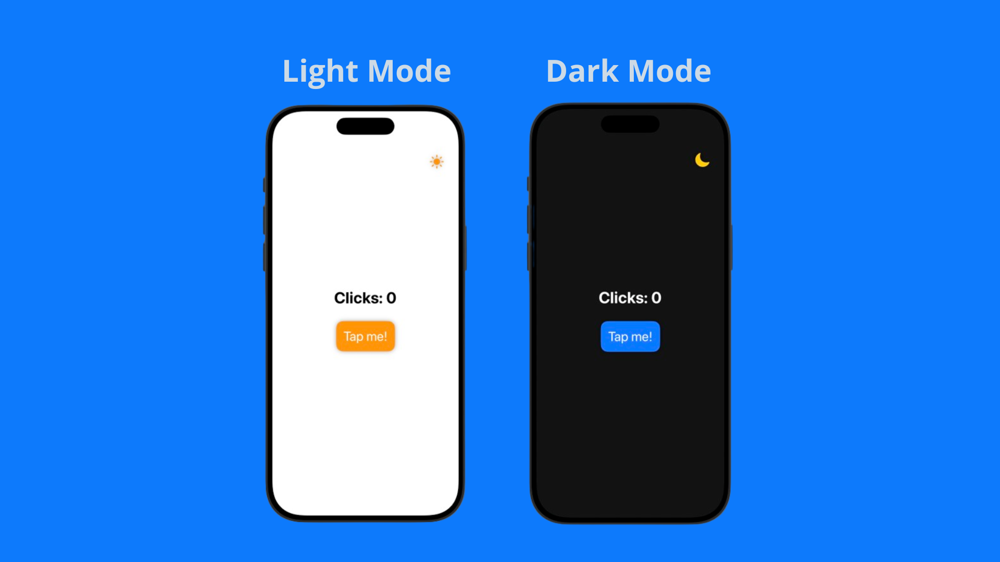

# ClickCount APP - My First Swift App
# 📱 ClickCount

A simple **SwiftUI** app where every tap counts.  
The goal is to tap the button, accumulate points, see floating number animations, confetti 🎉, and hear sound effects with each interaction.  

---

## ✨ Features

- **Click counter**: displays how many taps have been made.  
- **Haptic feedback**: every tap triggers a vibration using `UIImpactFeedbackGenerator`.  
- **Sound effects**:  
  - Click sound on each tap.  
  - Special sound when reaching milestones (e.g., every 100 taps).  
- **Floating numbers**: `+1` animation floating upward and fading out.  
- **Confetti**: celebration confetti every 100 taps.  
- **Dark/Light Mode Toggle**: switch between light and dark themes.  

---

## 🛠️ Technologies

- **SwiftUI** for UI.  
- **ConfettiSwiftUI** for confetti animations.  
- **AVFoundation** for playing sounds (`AVAudioPlayer`).  
- **UIKit Feedback Generator** for haptics.  

---

## 🚀 How to Run

1. Clone the repository:  
   ```bash
   git clone https://github.com/youruser/ClickCount.git
   cd ClickCount
   ```

2. Open the project in **Xcode** (`.xcodeproj` or `.xcworkspace`).  

3. Add the sound files `click.mp3` and `milestone.mp3` to the project (inside the main bundle).  

4. Run it on the simulator or a real device.  

---

## 📂 Project Structure

- **ContentView.swift** → main app screen.  
  - `FloatingText`: view for floating number animation.  
  - `ContentView`: counter, tap button, DarkMode toggle, and confetti.  
  - `playSound` function: handles audio playback.  

---

## 🖼️ Demo (Screenshots)

>  

---

## 📌 Future Improvements

- Level system (e.g., “Level 1 every 500 taps”).  
- Theme and color customization.  
- Persistent statistics (using `AppStorage` or `CoreData`).  
- Additional and customizable sounds.  

---

## 📄 License

This project is open-source. Feel free to use it 🚀  